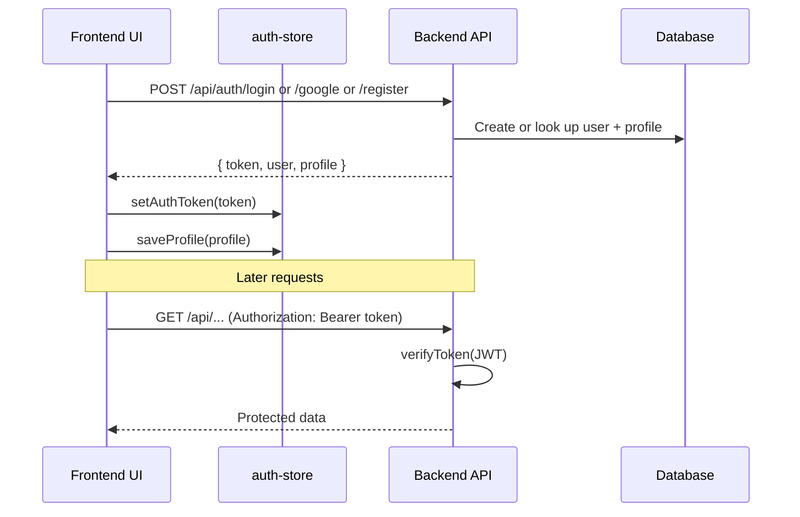

# tapme Authentication

This document describes how sign-in, registration, Google OAuth, session tokens, and route protection work across the tapme frontend and backend.

## Overview

tapme uses **JWT bearer tokens** issued by the backend API. The frontend stores the token client-side and sends it on every authenticated API request. There is no server-side session store — the JWT is self-contained and validated on each request.

Supported sign-in methods:

| Method | Creates account? | Password required? |
|--------|------------------|--------------------|
| Email + password (register) | Yes | Yes (min 8 chars) |
| Email + password (login) | No | Yes |
| Google OAuth | Yes, on first use | No |
| Password reset | No | Sets a new password |

Google sign-in and email registration both create a **user record** and a **default profile** in one step.

---

## Architecture



### Key frontend modules

| File | Role |
|------|------|
| `src/context/auth-context.tsx` | Auth state, modals, sign-in/sign-out handlers |
| `src/lib/auth-store.ts` | Token read/write (localStorage + cookie), cross-host helpers |
| `src/lib/auth-api.ts` | HTTP calls to `/api/auth/*` |
| `src/lib/profile-store.ts` | Caches the signed-in user's profile locally |
| `src/components/sign-in-modal.tsx` | Email login, password reset, Google button |
| `src/components/register-modal.tsx` | Email registration |
| `src/components/dashboard-gate.tsx` | Blocks dashboard until auth + profile are ready |

### Key backend modules

| File | Role |
|------|------|
| `backend/src/routes/auth.routes.ts` | Auth HTTP routes |
| `backend/src/services/auth.service.ts` | Register, login, Google, password logic |
| `backend/src/middleware/auth.ts` | `requireAuth` — validates `Authorization: Bearer` header |
| `backend/src/utils/jwt.ts` | Sign and verify JWTs |
| `backend/src/utils/password.ts` | bcrypt hash/compare |

---

## JWT tokens

### Payload

When a user authenticates successfully, the backend signs a JWT containing:

- `userId` — internal user ID
- `email` — user email
- `profileSlug` — URL slug for the user's public profile

Default expiry is **7 days** (`JWT_EXPIRES_IN` in backend `.env`, default `7d`).

### Verification

Protected API routes use `requireAuth` middleware:

1. Read `Authorization: Bearer <token>` from the request header.
2. Verify the signature and expiry with `JWT_SECRET`.
3. Attach the decoded payload to `req.auth`.
4. Return `401` if the token is missing, invalid, or expired.

The frontend attaches the token automatically in `auth-api.ts` and other API clients via `getAuthToken()`.

---

## Token storage (frontend)

Tokens are stored under the key `tapme-auth-token`.

### Single-host (simple dev)

On a single origin (e.g. everything on `localhost:8080`), the token lives in **localStorage** only.

### Multi-subdomain (production / local subdomains)

When subdomain routing is enabled (`tapme.rw`, `profile.tapme.rw`, `me.tapme.rw`, etc.), the token is stored in **both**:

1. **localStorage** — fast access on the current host
2. **Cookie** — `domain=.tapme.rw` (or `.localhost` in dev) so sibling subdomains can share auth

Cookie settings: `path=/`, `max-age=7 days`, `SameSite=Lax`, `Secure` on HTTPS.

### Cross-host navigation

`localStorage` is not shared across subdomains. When navigating from marketing (`tapme.rw`) to dashboard (`profile.tapme.rw`), the app appends a one-time token to the URL:

```
https://profile.tapme.rw/?auth=<jwt>
```

On arrival, `bootstrapAuthFromUrl()` in `auth-store.ts`:

1. Reads the `auth` query parameter
2. Saves it via `setAuthToken()`
3. Strips the parameter from the URL with `history.replaceState` (so the token is not left in the address bar)

`goToDashboard()` in `navigation.ts` calls `withCrossHostAuth()` to add this parameter automatically.

`bootstrapAuthFromUrl()` runs in route `beforeLoad` hooks on `/` and `/_dashboard` so the token is applied before auth checks run.

---

## Email + password auth

### Registration

**UI:** Register modal (`register-modal.tsx`) or `/register` (opens modal, redirects to `/`).

**Flow:**

1. User submits full name, email, password (min 8 characters).
2. `POST /api/auth/register` with `{ fullName, email, password }`.
3. Backend checks email is not already registered.
4. Backend creates:
   - A **user** with bcrypt-hashed password
   - A **profile** with a unique slug derived from the full name
5. Backend returns `{ token, user, profile }`.
6. Frontend calls `completeSignIn()` → stores token, profile, redirects to dashboard.

### Login

**UI:** Sign-in modal (`sign-in-modal.tsx`) or `/signin` (opens modal, redirects to `/`).

**Flow:**

1. User submits email and password.
2. `POST /api/auth/login`.
3. Backend finds user by email, verifies bcrypt password.
4. If the account is Google-only (`passwordHash` is missing), login is rejected with a message to use Google instead.
5. Returns JWT + user + profile.

### Password reset

Available inside the sign-in modal (forgot-password mode).

**Flow:** `POST /api/auth/reset-password` with `{ email, newPassword }`. No email verification link — the reset is applied immediately if the account exists. Google-only accounts cannot reset a password this way.

### Change password (signed in)

**Flow:** `PATCH /api/auth/password` with `{ currentPassword, newPassword }`. Requires a valid JWT. Not available for Google-only accounts.

---

## Google OAuth

### Setup

**Frontend** (`src/routes/__root.tsx`):

- Reads `VITE_GOOGLE_CLIENT_ID`
- Wraps the app in `GoogleOAuthProvider` when the client ID is set
- Without it, the Google button is hidden in the sign-in modal

**Backend** (`.env`):

```
GOOGLE_CLIENT_ID=...
GOOGLE_CLIENT_SECRET=...   # optional for ID-token verification; client ID is required
```

If Google is not configured on the backend, `POST /api/auth/google` returns `503`.

### UI flow

1. User clicks **Continue with Google** in the sign-in modal.
2. `@react-oauth/google` shows Google's popup and returns a **credential** (Google ID token JWT).
3. Frontend sends `POST /api/auth/google` with `{ credential }`.
4. Backend verifies the ID token with `google-auth-library` (`OAuth2Client.verifyIdToken`).
5. Backend reads from the verified payload:
   - `sub` → stored as `googleId`
   - `email`
   - `name` / `given_name` + `family_name` → profile full name
   - `picture` → profile `avatarUrl` (requested at 512px via `?sz=512`)
6. Same `completeSignIn()` path as email auth.

### Account resolution

| Scenario | Behavior |
|----------|----------|
| New Google user | Creates user (no password) + profile with Google name, email, and avatar |
| Existing user with same `googleId` or email | Signs in to existing account |
| Email user later uses Google (same email) | Links `googleId` to existing account; backfills avatar/name/email on profile if those fields were empty |

Google-only users have **no `passwordHash`**. They cannot use email/password login until a password is set via reset (which is blocked for pure Google accounts).

### Register vs Google

There is no Google button on the register modal. New users can still **sign up with Google** from the sign-in modal — first Google sign-in creates the account automatically.

---

## Session bootstrap on page load

When the app loads and a token already exists:

1. `AuthProvider` sets `isBootstrapping = true`.
2. Calls `GET /api/auth/me` with the stored token.
3. On success: refreshes profile in `profile-store`, sets `isSignedIn = true`, syncs subscription.
4. On failure (expired/invalid token): clears token and treats user as signed out.
5. `ProfileProvider` loads `GET /api/profiles/me/profile` when signed in.
6. `DashboardGate` waits for both auth bootstrap and profile load before rendering dashboard content.

---

## Route protection

### Dashboard routes (`/_dashboard/*`)

`src/routes/_dashboard.tsx` `beforeLoad`:

1. `bootstrapAuthFromUrl()` — pick up cross-host token
2. If subdomain routing is on and user is not on the dashboard host → redirect to `profile.tapme.rw` (or `profile.localhost:8080`)
3. If not authenticated → redirect to marketing `/register`

### Dashboard home on profile subdomain

`src/routes/index.tsx` on `profile.tapme.rw`:

- Unauthenticated users → redirect to marketing `/register`
- Authenticated users → render dashboard home inside `DashboardGate`

### Public routes

Marketing pages, public profiles (`/$slug`), contact, pricing, etc. do not require auth.

---

## API reference

All auth endpoints are under `/api/auth`. Responses use `{ success: true, data: ... }` or `{ success: false, error: { message } }`.

| Method | Path | Auth | Body | Response `data` |
|--------|------|------|------|-----------------|
| `POST` | `/register` | No | `{ fullName, email, password }` | `AuthResponse` |
| `POST` | `/login` | No | `{ email, password }` | `AuthResponse` |
| `POST` | `/google` | No | `{ credential }` | `AuthResponse` |
| `POST` | `/reset-password` | No | `{ email, newPassword }` | `{ message }` |
| `GET` | `/me` | Bearer | — | `{ user, profile }` |
| `PATCH` | `/password` | Bearer | `{ currentPassword, newPassword }` | `{ message }` |

### `AuthResponse` shape

```ts
{
  token: string;
  user: {
    id: string;
    email: string;
    profileSlug: string;
  };
  profile: UserProfile;  // full digital profile object
}
```

---

## Environment variables

### Frontend (`.env` / Vite)

| Variable | Purpose |
|----------|---------|
| `VITE_GOOGLE_CLIENT_ID` | Google OAuth client ID for the sign-in button |
| `VITE_API_URL` | API base URL (empty in dev → Vite proxies `/api` to `:3001`) |
| `VITE_COOKIE_DOMAIN` | Optional cookie domain override (default: `.tapme.rw` or `.localhost`) |
| `VITE_MARKETING_HOST` | Marketing host (default `tapme.rw`) |
| `VITE_DASHBOARD_HOST` | Dashboard host (default `profile.tapme.rw`) |
| `VITE_PUBLIC_PROFILE_HOST` | Public profile host (default `me.tapme.rw`) |

### Backend (`.env`)

| Variable | Purpose |
|----------|---------|
| `JWT_SECRET` | Secret for signing/verifying JWTs |
| `JWT_EXPIRES_IN` | Token lifetime (default `7d`) |
| `GOOGLE_CLIENT_ID` | Must match frontend client ID for ID token verification |
| `GOOGLE_CLIENT_SECRET` | Optional; not required for ID-token-only flow |
| `CORS_ORIGIN` | Allowed frontend origin(s) |

---

## Sign-out

`signOut()` in `auth-context.tsx`:

1. `clearAuthToken()` — removes localStorage entry and cookie
2. `clearCurrentUserSlug()` — clears profile cache key
3. Sets `isSignedIn` to `false`

No server-side logout endpoint — the JWT simply expires or is discarded client-side.

---

## Security notes

- Passwords are hashed with **bcrypt** (10 rounds); plain passwords are never stored.
- Google ID tokens are **verified server-side**; the frontend credential is not trusted without verification.
- JWT secret must be strong and unique in production.
- Cross-host auth uses a URL query parameter briefly; it is removed immediately after read.
- Password reset does not send email verification — consider adding email flows before production hardening.
- Admin auth (`dash.tapme.rw`) is a **separate** system in the admin app, not covered here.

---

## Local development URLs

| App | URL |
|-----|-----|
| Marketing | `http://localhost:8080` |
| Dashboard | `http://profile.localhost:8080` |
| Public profiles | `http://me.localhost:8080/{slug}` |
| API | `http://localhost:3001` (run `cd backend && npm run dev`) |

After signing in on marketing, `goToDashboard()` navigates to `profile.localhost:8080/?auth=...` so the dashboard receives the token.
